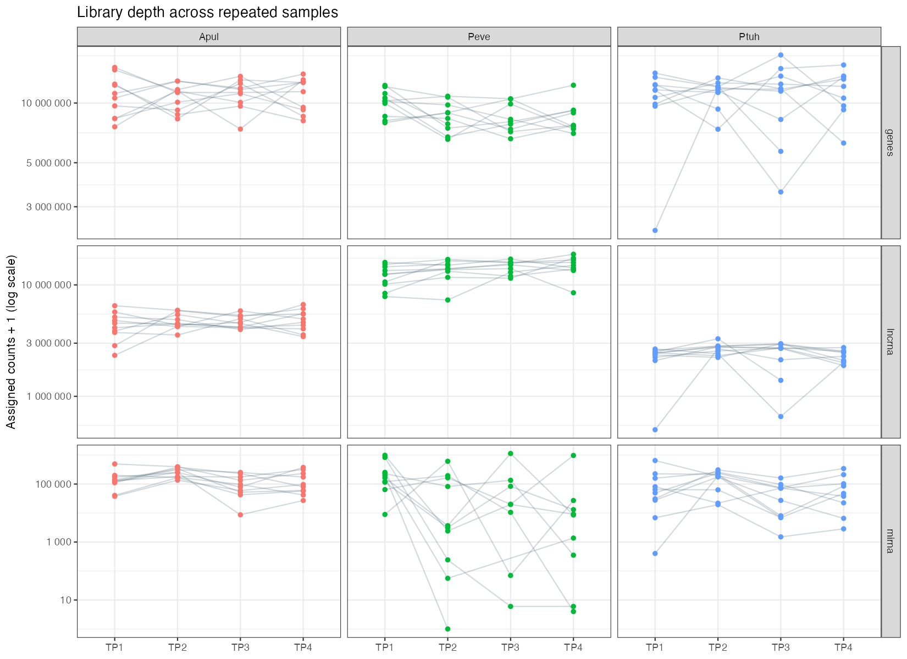
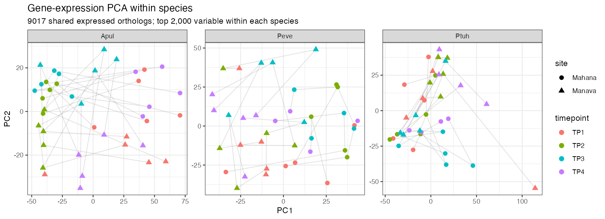

# MOSAiC data QC review

Evaluated 2026-10-07 against repository commit `d4708a2`, MOSAiC source commit `86432e3e393aecca307be356e514c95981177b7c`, and the 2026-10-07 checksum lock. This is a descriptive audit of existing harmonized data, not a new hypothesis test. The audit did not alter source data, sample inclusion rules, or hypothesis results. This directory preserves the report and its supporting tables and figures.

## Scope and interpretation

The audit used the loaders in `R/load.R` to inspect 14 molecular matrices (genes, miRNA, lncRNA and CpGs for each species, plus metabolomics and lipidomics), physiology, ITS2, the sample design, and daily temperature. It checked identifiers, numerical validity, feature and sample duplication, count composition, missingness, sample coverage, and within-species/timepoint patterns.

The molecular sampling frame is **10 colonies per species**, with up to four repeated samples per colony. The larger physiology/ITS2 cohort contains additional colonies and taxonomic annotations. Those cohorts must not be conflated. Library totals below are assigned feature counts, not sequenced reads or measures of organism-wide expression. All PCA and correlations are exploratory diagnostics, with no p-values or automatic exclusions.

## Highest-priority findings

### 1. Peve lncRNA totals are dominated by one overlapping locus

The five largest features account for a median **90.6%** of each Peve lncRNA library, versus 9.3% in Apul and 15.5% in Ptuh. They are `lncRNA_4889`, `_4890`, `_4891`, `_4893`, and `_4892`, all on `Porites_evermani_scaffold_167`, spanning positions 401565–406993. Several intervals are nested or overlapping. `_4889` and `_4890` have exactly identical expression vectors across all 38 samples; each contributes about 26% of the species' pooled lncRNA counts. Their feature IDs are distinct, so the usual duplicate-ID check does not detect this.

This is strong evidence of non-independent feature quantification at a dominant locus; it does not establish whether the underlying transcription is artifactual. Review the upstream transcript definitions, overlap/multimapping assignment settings, and read coverage. Quantify sensitivity to collapsing overlapping loci or omitting this locus before interpreting cross-layer coupling or total lncRNA abundance. Do not simply sum overlapping features as independent RNA molecules.

Separately, one Peve gene accounts for a median **15.8%** of gene counts (up to 31.0%), and the top five genes account for 37.3%. `Peve_00009618` is the top gene in 37/38 samples; it lies on the same scaffold near the dominant lncRNA locus. This is a composition warning, not proof of a gene annotation error. Neither of the two observed dominant gene IDs has a protein-name match in the loaded ortholog table.

Evidence: [dominant lncRNA coordinates](peve_top_lncrnas.csv), [sample count composition](count_composition.csv).

### 2. Calcification has an abrupt, shared timepoint scale shift

In the molecular subset, median `calc.umol.cm2.hr` values are:

| Species | TP1 | TP2 | TP3 | TP4 |
|---|---:|---:|---:|---:|
| Apul | 0.00513 | 0.229 | 0.326 | 0.00411 |
| Peve | 0.0107 | 0.728 | 0.955 | 0.00845 |
| Ptuh | 0 | 0.141 | 0.101 | 0.00314 |

Apul and Peve rise approximately 45–68-fold from TP1 to TP2 using the marginal medians, and fall back at TP4. The pattern occurs in the same core colonies, although missing observations and zero values affect paired ratios. Ptuh has six zeros among ten TP1 samples, making baseline fold changes unreliable.

**Check the assay calculations, units, and incubation-time conversion before interpreting this as seasonality.** A minutes-versus-hours conversion is a specific possibility worth checking: dividing TP2/TP3 values by 60 brings their medians into the same order of magnitude as TP1/TP4. This is a diagnostic observation, not an established correction; no values have been rescaled.

`POC-52-TP2` is also an extreme individual value at about 2.04, compared with a Ptuh TP2 core median of 0.141. Review it separately from the systematic timepoint shift.

Evidence: [calcification summary](calcification_time_summary.csv), [paired physiology records](paired_physiology_ratios.csv).

### 3. The broader species labels mix taxonomic annotations

Among ITS2 records, **43 records labeled Peve carry the haplotype annotation “Porites lobata lutea,” and 47 records labeled Ptuh carry “Pocillopora meandrina.”** The design maps species from the POR/POC prefix, which does not distinguish those annotations. The 10-colony molecular subsets all have the intended species annotations.

Whole-cohort physiology/ITS2 comparisons should therefore be described as broader code groups unless they are explicitly restricted or stratified by haplotype. In particular, H10 currently uses all ITS2 records grouped by the design species field. Validate the taxonomic metadata before treating those whole-cohort results as species-specific.

There is also a corrected-ID conflict: physiology sample **`POR-206-TP2` has `colony_id_corr = POR-251`**, while other timepoints use `POR-251`. This can split a repeated colony into two IDs. It is outside the molecular subset. Resolve from upstream metadata before changing the canonical key.

Evidence: [design taxonomic composition](haplotype_composition.csv), [ITS2 taxonomic composition](its2_taxonomic_composition.csv), [corrected-ID conflict](colony_id_conflicts.csv); underlying annotations are in `config/design.csv` and the loaded physiology/ITS2 tables.

### 4. Peve miRNA quality is confounded with time

Using the repository's existing >=1,000 assigned-count criterion, Peve retains **10 / 7 / 6 / 6** samples at TP1–TP4. Eight of 37 libraries fail, all at TP2–TP4. `POR-236-TP2` is entirely zero; several others have only 3–69 counts. Even among retained libraries, median counts decrease **182,038 → 82,249 → 51,840 → 11,108**, a 16.4-fold TP1-to-TP4 difference.

Ptuh has one failing miRNA library, `POC-52-TP1` (401 counts). Apul has none. Continue the existing miRNA QC filter, report effective n by timepoint, and treat Peve miRNA time effects as potentially technical pending upstream library-quality review. Presence flags alone overstate usable miRNA coverage. This confirms decision D-011.

Evidence: [miRNA QC by time](mirna_qc_time.csv), [failed libraries](mirna_failed.csv).

### 5. Two Ptuh samples have low depth across RNA layers

- **POC-52-TP1:** 2.28 million gene counts versus a TP1 median of 11.63 million; 66.1% of gene features are zero. It also has only 0.502 million lncRNA counts and 401 miRNA counts.
- **POC-219-TP3:** 3.56 million gene counts versus a TP3 median of 11.78 million; 51.2% of gene features are zero. It has 0.658 million lncRNA counts and 1,505 miRNA counts, just above the miRNA cutoff.

POC-52-TP1 is the strongest Ptuh PC1 outlier. In the audit's log-CPM PCA, Ptuh PC1 correlates with log gene-library totals at **r = -0.766**; the sign of a PCA axis is arbitrary. This flags possible depth-related structure, not a confirmed sample swap or a reason for automatic exclusion. Inspect sequencing/mapping QC upstream and compare downstream estimates with and without these samples, preserving colony structure.

Evidence: [sample QC](sample_qc.csv), [PCA diagnostics](gene_pca_metrics.csv), [PCA figure](gene_pca.png).

## Coverage and comparability limitations

### Missing layers are structured by species and time

| Species | Genes TP1–TP4 | CpGs TP1–TP4 | Metabolomics/lipidomics TP1–TP4 |
|---|---|---|---|
| Apul | 10 / 10 / 10 / 10 | 9 / 10 / 10 / 10 | 10 / 0 / 10 / 9 |
| Peve | 10 / 10 / 9 / 9 | 10 / 9 / 9 / 9 | 10 / 10 / 9 / 9 |
| Ptuh | 10 / 10 / 10 / 9 | 9 / 9 / 7 / 7 | 10 / 0 / 10 / 9 |

There is no all-species four-timepoint comparison for metabolites/lipids. Ptuh methylation has only seven colonies at each later timepoint, and the intersection across timepoints may be smaller. Counts of complete six-layer samples based on availability flags are [recorded here](complete_overlap.csv); those counts precede miRNA QC and feature-level metabolite missingness.

All molecular colonies are split between **Mahana/Low (5) and Manava/High (5)** per species. There are no Hilton/Medium molecular samples. Nutrient category is completely confounded with site in that subset.

### CpG sets are highly unequal and differently distributed

CpG features number **96,772 Apul; 242,100 Peve; 1,991,606 Ptuh**, a 20.6-fold Ptuh/Apul difference. Ptuh has about 85–86% zero-methylation entries per typical sample, versus roughly 55% in Apul and 56–58% in Peve. Median sample means across retained CpGs are approximately 11–12%, 7%, and 3%, respectively.

These are different retained genomic site sets, with different numbers of samples subjected to the upstream all-samples coverage filter. The means are not a controlled species comparison. Coverage-depth evidence is not present in these percentage matrices, so equivalent filtering cannot be verified here. Use coverage-aware/common-locus or gene-set sensitivity checks before interpreting species methylation rankings. This confirms and extends D-008.

### Temperature windows are incomplete

The nominal 30-day windows contain **16 / 24 / 30 / 23 days** at Mahana and Manava across TP1–TP4. Hilton has **16 / 24 / 6 / 23 days**. All sites lack 2019-12-31 through 2020-01-13 and 2020-03-01 through 2020-03-06. Hilton additionally lacks 2020-08-22 through 2020-09-21. The logger record ends 2020-11-07, before the nominal TP4 date of November 15.

Site daily mean temperatures are strongly correlated (r about 0.996) but **are not identical**. Report coverage alongside exposure estimates; a 16-day mean is not a complete 30-day exposure. Exact collection dates remain nominal (D-006), and daily summaries cannot resolve logger-specific pooling or calibration questions.

Evidence: [window coverage](temperature_windows.csv), [missing date runs](temperature_gaps.csv), [site comparisons](temperature_site_pairs.csv).

## Other abnormalities

- Metabolomics has **173 missing cells among 13,536 (1.28%)**, affecting 54 metabolites. `ACR-229-TP1` is missing **24/141 metabolites (17.0%)**. Do not treat these as zeros; check detection limits and record a missingness policy before integration. Lipidomics has no missing cells. [Missing cells](metabolomics_missing_cells.csv).
- Physiology includes negative host biomass for `POC-48-TP2` (-4.70 mg/cm²) and negative symbiont biomass for `POC-45-TP2` (-0.0562 mg/cm²). Both are outside the molecular subset. Investigate blanks/tare subtraction or data entry; do not log-transform these without an explicit handling policy. [Negative values](physiology_negative.csv).
- `ACR-265-TP4` has gene data but no physiology row. Other molecular samples have missing individual physiology traits despite `has_physiology = TRUE`; a row-presence flag is not complete trait coverage. [Trait coverage](physiology_core.csv).
- lncRNA values are fractional in all three species, unlike integer gene/miRNA counts. This is compatible with upstream fractional assignment but requires provenance; shared expression preprocessing rounds these values for DESeq2. All lncRNA strands are annotated `+`, consistent with the known D-014 limitation. Do not infer strand/orientation from that field.

## Patterns worth biological follow-up, not established QC failures

Apul has a pronounced TP1/TP4 versus TP2/TP3 pattern in the gene PCA. The audit used 9,017 shared expressed three-way orthologs, selecting the 2,000 most variable within each species. Apul PC1 explains 47.5% of that selected-feature variance and has a weaker library-total correlation (r = -0.20) than Ptuh. This is consistent with the existing H01/H02 results, but PCA alone cannot distinguish season from unrecorded batch factors or establish species rankings.

Symbiont cell densities and chlorophyll generally decline toward TP3/TP4 in the molecular subset, while Apul/Ptuh host biomass tends to dip at TP3 and recover at TP4. These are descriptive patterns in repeated colonies. They deserve colony-blocked analysis after resolving measurement QC, especially the calcification scale shift.

## Checks that passed and limits

Across the 14 matrices there were no duplicate feature IDs, no missing feature IDs, no identical complete sample columns, no negative values, and no infinities. Genes, miRNAs, lncRNAs, CpGs, and lipids have no missing cells; metabolomics is the exception above. Gene/miRNA counts are integer-valued and CpG values lie within 0–100. Molecular presence flags agree with loaded matrix membership. Every ITS2 row sums to one within 1e-6. These integrity checks do not validate upstream read assignment, taxonomic identity, assay units, or independent biological replication.

The existing reproduction gate had passed 15 tests in the preceding code review. It was not rerun for this read-only data audit. No FASTQ/BAM inspection, raw methylation coverage analysis, assay recalculation, or new biological hypothesis fits were performed.

## Suggested order of follow-up

1. Reconcile calcification units/time conversions and Peve's dominant overlapping lncRNA locus with upstream records.
2. Correct/stratify broader taxonomic labels and resolve the POR-206/POR-251 identity conflict.
3. Review the two Ptuh RNA outliers and enforce effective miRNA sample counts by timepoint.
4. Design downstream comparisons around missing omics timepoints, unequal CpG ascertainment, trait missingness, and incomplete temperature windows.

